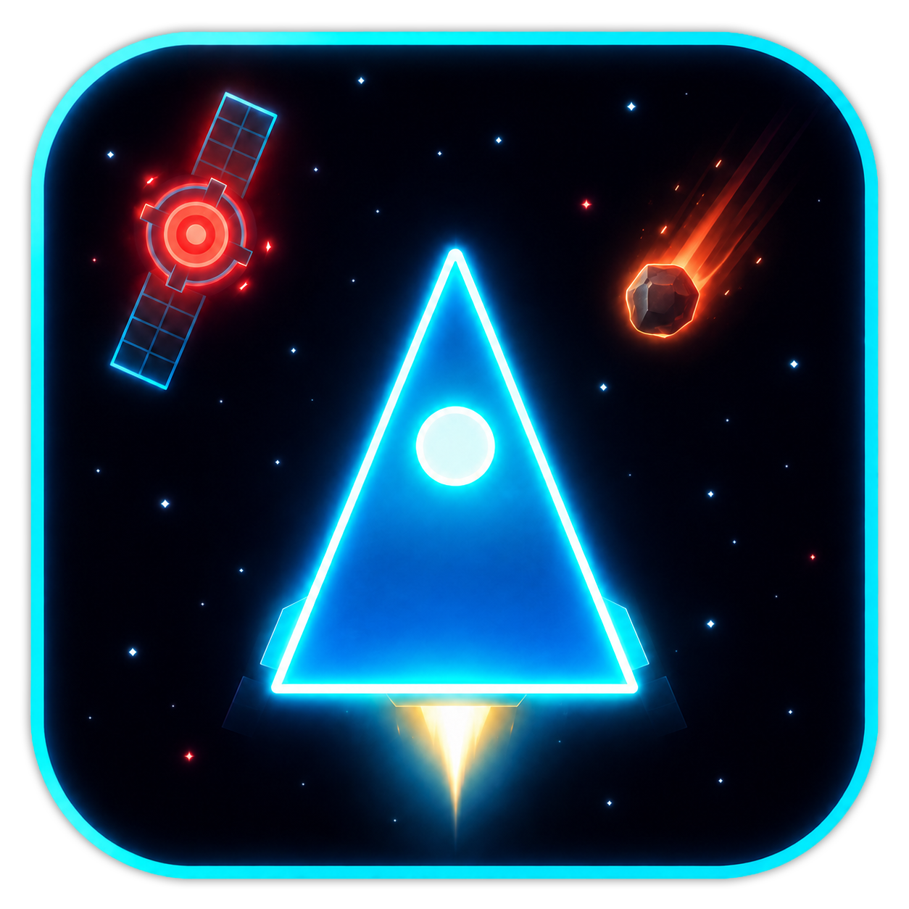

  

# SPACE RAIDERS

Ein 2D Retro-Arcade-Spiel im Stil der klassischen Weltraum-Shooter der 80er. Komplett in Vanilla-JS, HTML5 Canvas und CSS umgesetzt. 

Keine Frameworks, keine Build-Tools, einfach im Browser öffnen und losspielen.

## Über das Spiel

Du steuerst ein Raumschiff und musst dich so lange wie möglich gegen anrückende Raumstationen und Kometen behaupten.

## Features

- Klassischer Arcade-Look
- Synthesizer-Soundtrack und Sound-Effekte
- Verschiedene Gegnertypen: Raumstationen und Kometen
- Statistiken: überlebte Zeit, Kills nach Typ
- Pausenfunktion und Restart
- Responsive HUD mit Echtzeit-Anzeige

## Steuerung

| Taste            | Aktion        |
|------------------|---------------|
| `←` / `→`        | Bewegen       |
| `A` / `D`        | Bewegen       |
| `SPACE`          | Schießen      |
| `P`              | Pause         |
| `ENTER`          | Neustart      |

## Jetzt spielen

